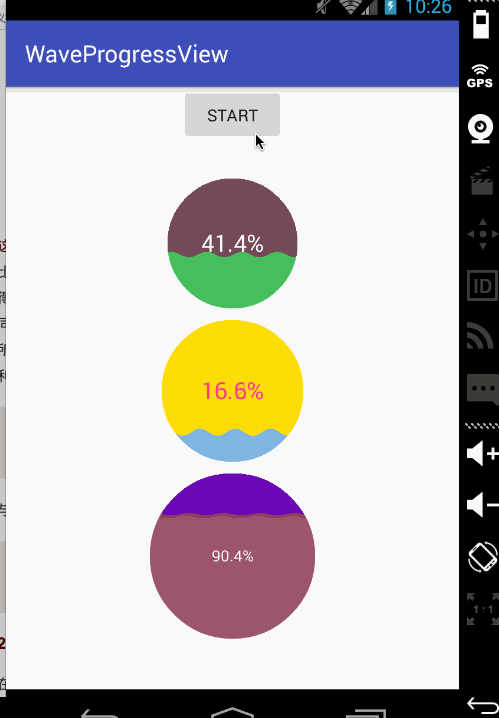

# WaveProgressView
Android-模拟水波纹进度条
#原理分析与实现
<http://blog.csdn.net/ta893115871/article/details/52245815/>
# 效果图

# 属性
```java
radius  半径
radius_color 圈的颜色
progress_text_color 进度数字的颜色
progress_text_size 进度数字的大小
progress_color 进度的颜色
progress 当前的进度
maxProgress 最大的进度

```
# 声明-布局中
```java
 <com.gxz.waveprogressview.WaveProgressView
        android:id="@+id/wpv_2"
        android:layout_width="wrap_content"
        android:layout_height="wrap_content"
        android:layout_marginTop="10dp"
        wpv:maxProgress="120"
        wpv:progress_color="#DC7E2040"
        wpv:progress_text_size="13sp"
        wpv:radius="70dp"
        wpv:radius_color="#7F6B1AB3" />
```
#  使用
```java
 ObjectAnimator objectAnimator0 = ObjectAnimator.ofFloat(waveProgressView_0, "progress", 0f, 100f);
        objectAnimator0.setDuration(3300);
        objectAnimator0.setInterpolator(new LinearInterpolator());
        objectAnimator0.start();
```
 